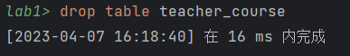
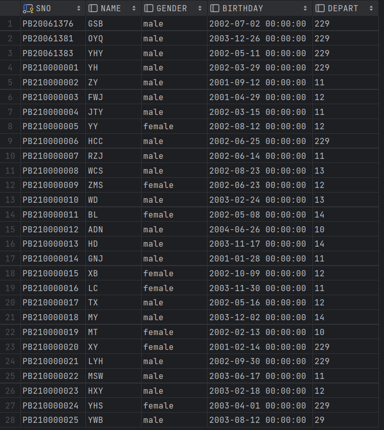
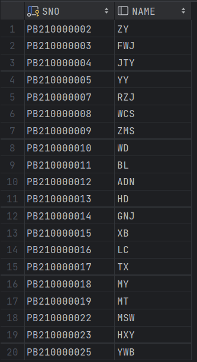

# 数据库系统概论_LAB1
> 作者：Xiaoma
> 
> 完成时间：2023.4.12
>
> 实验环境 MySQL 8.0.32  &emsp;DataGrip2023

<!-- TOC -->

- [数据库系统概论_LAB1](#%E6%95%B0%E6%8D%AE%E5%BA%93%E7%B3%BB%E7%BB%9F%E6%A6%82%E8%AE%BA_lab1)
    - [实验要求](#%E5%AE%9E%E9%AA%8C%E8%A6%81%E6%B1%82)
    - [任务一](#%E4%BB%BB%E5%8A%A1%E4%B8%80)
    - [任务二](#%E4%BB%BB%E5%8A%A1%E4%BA%8C)
    - [任务-修改基本表](#%E4%BB%BB%E5%8A%A1-%E4%BF%AE%E6%94%B9%E5%9F%BA%E6%9C%AC%E8%A1%A8)
        - [题目1](#%E9%A2%98%E7%9B%AE1)
        - [题目2](#%E9%A2%98%E7%9B%AE2)
        - [题目3](#%E9%A2%98%E7%9B%AE3)
        - [题目4](#%E9%A2%98%E7%9B%AE4)
        - [题目5](#%E9%A2%98%E7%9B%AE5)
        - [题目6](#%E9%A2%98%E7%9B%AE6)
        - [题目7](#%E9%A2%98%E7%9B%AE7)
        - [题目8](#%E9%A2%98%E7%9B%AE8)
        - [题目9](#%E9%A2%98%E7%9B%AE9)
        - [题目10](#%E9%A2%98%E7%9B%AE10)
        - [题目11](#%E9%A2%98%E7%9B%AE11)
        - [题目12](#%E9%A2%98%E7%9B%AE12)
        - [题目13](#%E9%A2%98%E7%9B%AE13)
        - [题目14](#%E9%A2%98%E7%9B%AE14)
        - [题目15](#%E9%A2%98%E7%9B%AE15)
        - [题目16](#%E9%A2%98%E7%9B%AE16)
        - [题目17](#%E9%A2%98%E7%9B%AE17)
        - [题目18](#%E9%A2%98%E7%9B%AE18)
        - [题目19](#%E9%A2%98%E7%9B%AE19)
        - [题目20](#%E9%A2%98%E7%9B%AE20)
        - [题目21](#%E9%A2%98%E7%9B%AE21)
        - [题目22](#%E9%A2%98%E7%9B%AE22)
        - [题目23](#%E9%A2%98%E7%9B%AE23)
        - [题目24](#%E9%A2%98%E7%9B%AE24)
        - [题目25](#%E9%A2%98%E7%9B%AE25)
        - [题目26](#%E9%A2%98%E7%9B%AE26)
        - [题目27](#%E9%A2%98%E7%9B%AE27)
        - [题目28](#%E9%A2%98%E7%9B%AE28)
        - [题目29](#%E9%A2%98%E7%9B%AE29)
        - [题目30](#%E9%A2%98%E7%9B%AE30)
        - [题目31](#%E9%A2%98%E7%9B%AE31)
        - [题目32](#%E9%A2%98%E7%9B%AE32)
        - [题目33](#%E9%A2%98%E7%9B%AE33)
        - [题目34](#%E9%A2%98%E7%9B%AE34)
        - [题目35](#%E9%A2%98%E7%9B%AE35)
        - [题目36](#%E9%A2%98%E7%9B%AE36)
        - [题目37](#%E9%A2%98%E7%9B%AE37)
        - [题目38](#%E9%A2%98%E7%9B%AE38)
        - [题目39](#%E9%A2%98%E7%9B%AE39)
        - [题目40](#%E9%A2%98%E7%9B%AE40)
        - [题目41](#%E9%A2%98%E7%9B%AE41)
        - [题目42](#%E9%A2%98%E7%9B%AE42)
        - [题目43](#%E9%A2%98%E7%9B%AE43)
        - [题目44](#%E9%A2%98%E7%9B%AE44)
        - [题目45](#%E9%A2%98%E7%9B%AE45)
        - [题目46](#%E9%A2%98%E7%9B%AE46)
        - [题目47](#%E9%A2%98%E7%9B%AE47)
        - [题目48](#%E9%A2%98%E7%9B%AE48)
        - [题目49](#%E9%A2%98%E7%9B%AE49)
        - [题目50](#%E9%A2%98%E7%9B%AE50)

<!-- /TOC -->
## 实验要求
- 安装并配置MySQL数据库
- 创建`Student`,`Teacher`,`Course`,`Score`四个关系表
- 按照顺序写出实现实验要求的SQL语句

## 任务一
> 安装并配置MySQL数据库

安装成功的结果如下所示


## 任务二
> 创建`Student`,`Teacher`,`Course`,`Score`四个关系表
>

首先创建新的数据库`lab1`，并进入该数据库。

```SQL
create database if not exists lab1;
use lab1;
```


然后建立四个关系表

```SQL
create table Student
(
    SNO char(11) primary key comment '学生学号',
    NAME varchar(10),
    GENDER varchar(6),
    BIRTHDAY datetime,
    DEPART varchar(10) comment '系别'
);

create table Teacher
(
    TNO char(7) primary key comment '教师工号',
    NAME varchar(10),
    GENDER varchar(6),
    BIRTHDAY datetime,
    POSITION varchar(25) comment '职称',
    DEPART varchar(10) comment '系别'
);

create table Course
(
    CNO char(8) primary key comment '课程编号',
    NAME char(30),
    TNO char(7) comment '教师工号',
    foreign key (TNO) references Teacher(TNO)
);

create table Score
(
    SNO char(11)  comment '学生学号',
    CNO char(8) comment '课程编号',
    DEGREE int comment '学生成绩',
    foreign key (SNO) references Student(SNO),
    primary key (SNO, CNO)
);

```


插入数据-使用`insert into`（此处会警告用户`datetime`类型数据最好写为标准形式）

```SQL
insert into Student (SNO, NAME, GENDER, BIRTHDAY, DEPART)
values
    ('PB210000001', 'YH', 'male', '2002/3/29 0:00', 229),
    ('PB210000002', 'ZY', 'male', '2001/9/12 0:00', 11),
    ('PB210000003',	'FWJ', 'male', '2001/4/29 0:00', 12),
    ('PB210000004', 'JTY', 'male', '2002/3/15 0:00', 11),
    ('PB210000005', 'YY', 'female', '2002/8/12 0:00', 12),
    ('PB210000006', 'HCC', 'male', '2002/6/25 0:00', 229),
    ('PB210000007', 'RZJ', 'male', '2002/6/14 0:00', 11),
    ('PB210000008', 'WCS', 'male', '2002/8/23 0:00', 13),
    ('PB210000009', 'ZMS', 'female', '2002/6/23 0:00', 12),
    ('PB210000010', 'WD', 'male', '2003/2/24 0:00', 13),
    ('PB210000011', 'BL', 'female', '2002/5/8 0:00', 14),
    ('PB210000012', 'ADN', 'male', '2004/6/26 0:00', 10),
    ('PB210000013', 'HD', 'male', '2003/11/17 0:00',14),
    ('PB210000014', 'GNJ', 'male', '2001/1/28 0:00', 11),
    ('PB210000015', 'XB', 'female', '2002/10/9 0:00', 12),
    ('PB210000016', 'LC', 'female', '2003/11/30 0:00', 11),
    ('PB210000017', 'TX', 'male', '2002/5/16 0:00', 12),
    ('PB210000018', 'MY', 'male', '2003/12/2 0:00', 14),
    ('PB210000019', 'MT', 'female', '2002/2/13 0:00', 10),
    ('PB210000020', 'XY', 'female', '2001/2/14 0:00', 229),
    ('PB210000021', 'LYH', 'male', '2002/9/30 0:00', 229),
    ('PB210000022', 'MSW', 'male', '2003/6/17 0:00', 11),
    ('PB210000023', 'HXY', 'male', '2003/2/18 0:00', 12),
    ('PB210000024', 'YHS', 'female', '2003/4/1 0:00', 229),
    ('PB210000025', 'YWB', 'male', '2003/8/12 0:00', 29);
```


插入数据-使用`load data infile`。
```SQL
show global variables like '%secure_file_priv%';

load data infile 'F:\\DataGrip\\lab1\\Teacher.csv'
into table Teacher
fields terminated by ','
enclosed by '"'
lines terminated by '\r\n'
ignore 1 ROWS ;

load data infile 'F:\\DataGrip\\lab1\\course.csv'
into table Course
fields terminated by ','
enclosed by '"'
lines terminated by '\r\n'
ignore 1 ROWS ;

load data infile 'F:\\DataGrip\\lab1\\score.csv'
into table Score
fields terminated by ','
enclosed by '"'
lines terminated by '\r\n'
ignore 1 ROWS ;
```


最终四个关系表之间的关系为


## 任务-修改基本表

### 题目1
>在学生表Student中增加一个新的属性列AGE（年龄），类型为int。

```SQL
alter table Student add AGE int comment '年龄';
```


### 题目2
> 计算每个学生的年龄（AGE）（简单用2023减去出生年份即可）。注意，次操作可能需要关闭安全模式；提示，可使用MySQL的year函数。
>

```SQL
update Student set AGE = 2023 - year(BIRTHDAY);
```


### 题目3
> 为每个学生的年龄加2
>

```SQL
update Student set AGE = AGE + 2;
```


### 题目4
> 将AGE（年龄）的数据类型由int改为char。

```SQL
alter table Student modify AGE char(2);
```


### 题目5
> 删除属性列表AGE。
>

```SQL
alter table Student drop AGE;
```


### 题目6
> 创建一个教师课程数量表：teacher_course(TNO, NUM_COURSE)，两个属性分别表示授课教师工号，课程数量，类型自定义（注意，这里TNO还不是主键）。
>

```SQL
create table teacher_course
(
    TNO char(7) comment '教师工号',
    NUM_COURSE int comment '课程数量',
    foreign key (TNO) references Teacher(TNO)
);
```


### 题目7
> 为表teacher_course添加主键（TNO）。
```SQL
alter table teacher_course add primary key (TNO);
```


### 题目8
> 用一条语句，结合表course记录，为表teacher中所有教师，在表teacher_course添加对应记录（若是表course中未出现的教师，则课程数量为null。
>

```SQL
insert into teacher_course (TNO, NUM_COURSE)
select t.TNO, if(count(c.CNO), count(c.CNO), null)
from teacher t left outer join course c on c.TNO = t.TNO
group by (t.TNO);
```


### 题目9
> 删除表teacher_course中含有的null记录。
>

```SQL
delete from teacher_course where NUM_COURSE is null;
```


### 题目10
> 删除表teacher_course。
>

```SQL
drop table teacher_course;
```



### 题目11
> 在学生表student，成绩表score中分别插入一些数据，数据如下（注意：如果与原数据冲突，比如学号重复，请修改一下自己的信息保证能插入）。
>

```SQL
insert into student (SNO, NAME, GENDER, BIRTHDAY, DEPART)
values
    ('PB20061376', 'GSB', 'male', '2002-07-02 00:00:00', '229'),
    ('PB20061381', 'OYQ', 'male', '2003-12-26 00:00:00', '229'),
    ('PB20061383', 'YHY', 'male', '2002-05-11 00:00:00', '229');

insert into score (SNO, CNO, DEGREE)
VALUES
    ('PB20061376', '20230402', 96),
    ('PB20061376', '20230410', 97),
    ('PB20061376', '20230412', 98);
```





### 题目12
> 在score表中删除你所选的课程中成绩最低的一门课的记录

```SQL
delete from score 
where SNO = 'PB20061376' and DEGREE <= (select min(temp.DEGREE) from (select DEGREE from score where SNO = 'PB20061376') temp);
```


### 题目13
> 用create语句在course表的名称NAME上建立普通索引NAME_INDEX
>

```SQL
create index NAME_INDEX on course(NAME);
show index from course;
```


### 题目14
> 用create语句在teacher表的工号TNO上建立唯一索引TNO_INDEX
>

```SQL
create unique index TNO_INDEX on teacher(TNO);
show index from teacher;
```


### 题目15
> 用create语句在score表上的学号SNO，成绩DEGREE上建立复合索引RECORD_INDEX，要求学号为降序，序号相同时成绩为升序

```SQL
create index RECORD_INDEX on score(SNO desc, DEGREE asc);
```


### 题目16
> 用一条语句查询表score的索引
>

```SQL
show index from score;
```


### 题目17
> 删除teacher表字段TNO上的索引TNO_INDEX
>

```SQL
drop index TNO_INDEX on teacher;
show index from teacher;
```


### 题目18
> 查询和你属于同一个系的学生的学号和姓名（包括你本人）
>

```SQL
select s.SNO, s.NAME from student s where s.DEPART = '229';
```


### 题目19
> 查询和你属于同一个系的学生学号和姓名（不包括你本人）

```SQL
select s.SNO, s.NAME from student s
where s.DEPART = '229' and s.SNO <> 'PB20061376';
```


### 题目20
> 查询和你的某个好朋友属于同一个系的学生学号和姓名（11题插入的某个好友）

```SQL
select s.SNO, s.NAME from student s
where s.DEPART = (select DEPART from student where SNO = 'PB20061381');
```


### 题目21
> 查询和你的两个好友都不在同一个系的学生学号和姓名

```SQL
select s.SNO, s.NAME from student s
where s.DEPART not in (select DEPART from student where SNO = 'PB20061381' or SNO = 'PB20061383');
```




### 题目22
> 查询教过你的所有老师的工号和姓名

```SQL
select distinct t.TNO, t.NAME
from teacher t,
     (select c.TNO from course c where c.CNO in (select s.CNO from score s where s.SNO = 'PB20061376')) temp
where t.TNO in (temp.TNO);

```


### 题目23
> 查询11系和229系教师的总人数

```SQL
select t.DEPART, count(t.TNO)
from teacher t
where t.DEPART = '229' or t.DEPART = '11'
group by t.DEPART;
```


### 题目24
> 查询选修DB_Design课程且成绩在89分以上（包括89）的学生的学号、姓名和分数

```SQL
select stu.SNO, stu.NAME, s.DEGREE
from (student stu left join score s on stu.SNO = s.SNO),
     (select course.CNO from course where course.NAME = 'DB_Design') c
where s.CNO = c.CNO and s.DEGREE >= 89;
```


### 题目25
> 查询选修过“ZDH”老师课程的学生学号和姓名


```SQL
select distinct stu.SNO, stu.Name
from score s left join student stu on stu.SNO = s.SNO ,
     (select distinct c.CNO from course c left join teacher t on t.TNO = c.TNO where t.NAME = 'ZDH') temp
where s.CNO = temp.CNO;
```


### 题目26
> 查询选过某课程的学生学号和分数，并按照分数降序展示。（某课程是指course表中的某一门课程名NAME，你自行选择）（选择'Machine_Learning'）

```SQL
select stu.SNO, s.DEGREE
from score s left join student stu on stu.SNO = s.SNO, (select c.CNO from course c where c.NAME = 'Machine_Learning') temp
where s.CNO = temp.CNO
order by s.DEGREE desc ;
```


### 题目27
> 查询每门课的平均成绩，其中每行包含课程号、课程名和平均成绩（包括平均成绩为null）
>

```SQL
select  c.CNO, c.NAME, sum(s.DEGREE) / count(*)
from course c left join score s on c.CNO = s.CNO
group by c.CNO;
```


### 题目28
> 查询每门课的最高分和最低分，并计算其分数差。其中每行包含课程号、课程名和最高分、最低分和分数差（课程无成绩的不用包括

```SQL
select  c.CNO, c.NAME, max(s.DEGREE), min(s.DEGREE), max(s.DEGREE) - min(s.DEGREE)
from course c right join score s on c.CNO = s.CNO
group by s.CNO;
```


### 题目29
> 查询所教过的课程中有学生考试成绩低于72分的教师的工号和姓名（去掉重复行）

```SQL
select distinct t.TNO, t.NAME
from teacher t, (select c.TNO from score s left join course c on c.CNO = s.CNO where s.DEGREE < 72) temp
where t.TNO = temp.TNO;
```


### 题目30
> 查询选修了2门课程及以上的学生的学号、姓名

```SQL
select  stu.SNO, stu.NAME
from score s left join student stu on s.SNO = stu.SNO
group by stu.SNO
having count(*) >= 2;
```


### 题目31
> 查询student表中各个学生姓名与相应的平均成绩（没有选课的成绩平均成绩为0）

```SQL
select stu.NAME, avg(s.DEGREE)
from student stu left join score s on stu.SNO = s.SNO
group by stu.SNO;
```


### 题目32
> 查询每个系的学生人数和每个系的平均分，其中每行包括系号，系的人数和平均成绩。这里平均成绩是指每个学生的的所有课程的平均成绩计算后，与同一个系的其他同学再次计算平均值

```SQL
select temp.DEPART, count(*), sum(temp.avg_deg) / count(*)
from (select stu.NAME, stu.DEPART, avg(s.DEGREE) avg_deg
        from student stu left join score s on stu.SNO = s.SNO
        group by stu.SNO) temp
group by temp.DEPART;
```


### 题目33
> 查询所有未选修Data_Mining课程的学生姓名（去掉重复行）

```SQL
select distinct stu.SNO
from student stu
where stu.SNO not in (select distinct s.SNO from score s left join course c on s.CNO = c.CNO where c.NAME = 'Data_Mining');
```


### 题目34
> 查询各个课程的课程名及选该课学生的平均年龄（包括没有人选的课）
```SQL
select c.NAME, avg(2023 - year(stu.BIRTHDAY))
from course c left join score s on c.CNO = s.CNO left join student stu on s.SNO = stu.SNO
group by c.CNO;
```


### 题目35
> 查询各个课程的课程名中包含“Computer_Network”课程的学生的学号和姓名
```SQL
select stu.SNO, stu.NAME
from student stu
where stu.SNO in(select s.SNO from score s left join course c on s.CNO = c.CNO where c.NAME = 'Computer_Network');
```


### 题目36
> 查询成绩比该课程平均成绩高12分以上的同学的成绩表，即包含SNO、CNO、DEGREE

```SQL
select s.SNO, s.CNO, s.DEGREE
from score s,
     (select c.CNO,avg(s2.DEGREE) avg_deg
    from score s2  left join course c on s2.CNO = c.CNO
    where c.NAME = 'Computer_Network'
    group by s2.CNO) temp
where s.CNO = temp.CNO and s.DEGREE > temp.avg_deg + 12;
```


### 题目37
> 建立女学生的学生视图（db_female_student），属性与student一样，并要求对该视图进行修改和插入操作时仍需保证该视图只有女生

```SQL
create or replace view db_female_student
as select * from student where student.GENDER = 'female';
```


### 题目38
> 将女学生视图（db_demale_student）中学号为PB210000016的学生姓名改为你的名字（英文首字母）
```SQL
update db_female_student set NAME = 'GSB' where SNO = 'PB210000016';
```


### 题目39
> 在女学生视图（db_female_student）中找出年龄小于21岁的学生，包含SNO，NAME
```SQL
select SNO, NAME from db_female_student where (2023 - year(BIRTHDAY)) < 21;
```


### 题目40
> 向student表中插入一名学号SA210110021，姓名QXY，性别女，生日1997/7/27，12系的学生，然后查询视图db_female_student的所有学生，验证其是否更新。
```SQL
insert into student(sno, name, gender, birthday, depart)
values ('SA210110021', 'QXY', 'female', '1997-07-27', '12');

select * from db_female_student;
```


### 题目41
> 向视图db_female_student中插入一名学号SA210110023，姓名DPC，性别男，生日1997/4/27，11系的学生，观察到了什么现象？
```SQL
insert into db_female_student(sno, name, gender, birthday, depart)
values ('SA210110023', 'DPC', 'male', '1997-04-27', '11');

select * from db_female_student;
-- 事实上，新数据插入了基表中，但不符合视图限制条件，故不在视图中，实际上视图只保存查询逻辑，不保存查询结果。
```


### 题目42
> 删除视图db_female_student
```SQL
drop view db_female_student;
```


### 题目43
> 创建关系表：teacher_salary(TNO, SAL)，其中TNO是教师的工号（主键），SAL是教师工资（类型float）
```SQL
create table teacher_salary
(
    TNO char(7) primary key ,
    SAL float
);
```


### 题目44
> 定义一个BEFORE行级触发器，为关系表teacher_salary定义完整性规则：表中出现的工号必须也出现在teacher表中，否则报错。注：该规则实际上是外键约束，MySQL中可使用SIGNAL抛出错误，需要为INSERT和UPDATE分别定义触发器。请展示出成功创建触发器和测试抛出错误信息的截图
```SQL
create trigger  teacher_salary_trigger
    before insert on teacher_salary for each row
begin
    declare msg varchar(50);
    if(select count(*) from teacher t where t.TNO = NEW.TNO) = 0
        then set msg = 'The TNO is not in table teacher!';
        signal SQLSTATE '23000' set MESSAGE_TEXT = msg;
    end if;
end;

insert into teacher_salary(TNO, SAL)
values ('111111', 100.1);

insert into teacher_salary(TNO, SAL)
values ('TA90024', 10000);

create trigger teacher_salary_trigger2
    before update on teacher_salary for each row
begin
    declare msg varchar(50);
    if(select count(*) from teacher t where t.TNO = NEW.TNO) = 0
        then set msg = 'The TNO is not in table teacher!';
        signal SQLSTATE '23000' set MESSAGE_TEXT = msg;
    end if;
end;

update teacher_salary set TNO = '1234' where TNO = 'TA90024';

update teacher_salary set TNO = 'TA90025' where TNO = 'TA90024';

```


### 题目45
> 定义一个BEFORE行级触发器，为关系表teacher_salary指定完整规则：instructor/Associate Professor/Professor的工资不能低于4000/5000/6000，如果低于，则改为4000/5000/6000。注：需要为INSERT和UPDATE分别定义触发器。并检验触发器是否工作，为teacher_salary构造INSERT和UPDATE语句并激活所定义过的触发器，将过程截图展示
```SQL
create trigger  teacher_salary_trigger3
    before insert on teacher_salary for each row
begin
    declare msg varchar(50);
    declare position varchar(25);
    set position = (select t.POSITION from teacher t where t.TNO = NEW.TNO);
    if position = 'Instructor' and NEW.SAL < 4000
        then set NEW.SAL = 4000;
    end if;
    if position = 'Associate Professor' and NEW.SAL < 5000
        then set NEW.SAL = 5000;
    end if;
    if position = 'Professor' and NEW.SAL < 6000
        then set NEW.SAL = 6000;
    end if;
end;

insert into teacher_salary(TNO, SAL)
values ('TA90024', 1000);

insert into teacher_salary(TNO, SAL)
values
    ('TA90021', 1000),
    ('TA90022', 1000),
    ('TA90025', 1000),
    ('TA90030', 10000);

insert into teacher_salary(TNO, SAL)
values ('0000', 1000);
```


### 题目46
> 删除刚刚创建的所有触发器
```SQL
drop trigger teacher_salary_trigger;
drop trigger teacher_salary_trigger2;
drop trigger teacher_salary_trigger3;
```


### 题目47
> 将score表的Data_Mining课程成绩设为空值，然后再score表查询学生学号和分数，并按照分数升序展示。观察NULL在MySQL中的大小是怎样的？
```SQL
update score set DEGREE = null where CNO = (select c.CNO from course c where c.NAME = 'Data_Mining');
select s.SNO, s.DEGREE from score s order by s.DEGREE
-- null在升序排列中为最小值
```


### 题目48
> 自设计题目1：为score表新增列LEVEL，若DEGREE >= 85，则LEVEL为A，若60 =< DEGREE < 85，则LEVEL为B，若DEGREE < 60，则LEVEL为C，若成绩为null，则LEVEL为null。
```SQL
alter table score add LEVEL char(1);
update score set LEVEL =
    case when DEGREE >= 85 then 'A'
        when DEGREE < 85 and DEGREE >= 60 then  'B'
        when DEGREE < 60 then 'C'
        else null
    end;
```


### 题目49
> 自设计题目2：查询所有名字为三个字的学生学号和姓名
```SQL
select stu.SNO, stu.NAME from student stu where stu.NAME like '___';
```


### 题目50
> 自设计题目3：查询所有名字为三个字的学生学号和姓名，老师的工号和姓名
```SQL
select stu.SNO, stu.NAME from student stu where stu.NAME like '___'
union
select t.TNO, t.NAME from teacher t where t.NAME like '___';
```


