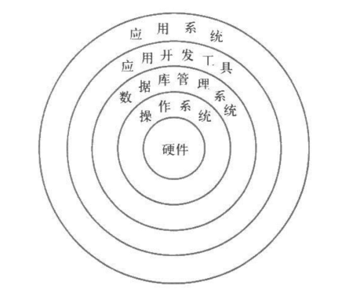

# 数据库系统概论-复习笔记
> Xiaoma

## 第一章-绪论

### 一、数据库系统概述

#### 数据库的4个基本概念

1. 数据
   - 定义：数据是数据库中存储的基本对象，描述事物的符号记录称为称为数据。描述事物的符号可以是数字、文字、图像、音频等。
   - 特点：数据的表现形式不能完全表达内容；数据与其语义是不可分的。
2. 数据库
   - 定义：数据库是长期存储在计算机内、有组织、可共享的大量数据的集合。
   - 特点：
        1. 数据按照一定的数据模型组织、描述和存储
        2. 为各种用户共享
        3. 冗余度较小
        4. 数据独立性较高
        5. 易扩展
3. 数据库管理系统
   - 定义：数据库管理系统是位于用户和操作系统之间的一层数据关系软件。数据库管理系统和操作系统一样是计算机的基础软件，也是一个大型复杂的软件系统。
   - 功能：
        1. 数据定义功能：
              - 提供数据定义语言(DDL)
              - 定义数据库中的数据对象
        2. 数据组织、存储和管理：
            - 分类组织、存储和管理各种数据
            - 确定组织数据的文件结构和存取方式
            - 实现数据之间的联系
            - 提供多种存取方法提高存取效率
        3. 数据操纵功能：
            - 提供数据操纵语言(DML)
            - 实现对数据库的基本操作（查询、修改、插入和删除）
        4. 数据库的事务管理和运行管理：
            - 数据库在建立、运行和维护时由DBMS统一管理和控制
            - 保证数据的安全性、完整性、多用户对数据的并发使用
            - 发生故障后的系统恢复
        5. 数据库的建立和维护功能：
            - 数据库初始数据装载转换
            - 数据库转储，介质故障恢复
            - 数据库的重组织
            - 性能监控、分析等
        6. 其他功能：
            - DBMS与网络中其他软件系统的通信
            - 两个DBMS系统的数据转换
            - 异构数据库之间的互访和互操作
4. 数据库系统
   - 定义：数据库系统在计算机系统引入数据库后的系统
   - 构成：
      1. 数据库
      2. 数据库管理系统（及其开发工具）
      3. 应用程序，应用系统
      4. 数据库管理员
   - 数据库系统如下图 

    

   - 引入数据库后计算机的层次结构如图所示 

    

### 二、数据管理技术的产生和发展
1. 数据管理：
   - 定义：对数据进行分类、组织、编码、存储、检索和维护
   - 数据处理的中心问题：对数据收集、存储、加工、传播、计算
2. 数据管理的发展阶段
在计算机硬件、软件发展的基础上，数据管理技术经历了人工管理、文件管理、数据库系统三个阶段，三个阶段的特点分别为
<table>
    <tr>
        <th></th>
        <th></th>
        <th>人工管理</th><th>文件管理</th><th>数据库系统</th>
    </tr>
    <tr>
        <td rowspan="4">背景</td>
        <td>应用背景</td>
        <td>科学计算</td>
        <td>科学测算、数据管理</td>
        <td>大规模数据管理</td>
    </tr>
    <tr>
        <td>硬件背景</td>
        <td>无直接存取存储设备</td>
        <td>磁盘、磁鼓</td>
        <td>大容量磁盘、磁盘阵列</td>
    </tr>
    <tr>
        <td>软件背景</td>
        <td>没有操作系统</td>
        <td>没有文件系统</td>
        <td>有数据库管理系统</td>
    </tr>
    <tr>
        <td>处理方式</td>
        <td>批处理</td>
        <td>联机实时处理、批处理</td>
        <td>联机实时处理、分布处理、批处理</td>
    </tr>
    <tr>
        <td rowspan="6">特点</td>
        <td>数据的管理者</td>
        <td>用户</td>
        <td>文件系统</td>
        <td>数据库管理系统</td>
    </tr>
    <tr>
        <td>数据面向的对象</td>
        <td>某一应用程序</td>
        <td>某一应用</td>
        <td>现实世界</td>
    </tr>
    <tr>
        <td>数据的共享程度</td>
        <td>无共享、冗余度极大</td>
        <td>共享性差、冗余度大</td>
        <td>共享性高、冗余度小</td>
    </tr>
    <tr>
        <td>数据独立性</td>
        <td>不独立，完全依赖于程序</td>
        <td>独立性差</td>
        <td>具有高度的物理性和一定的逻辑独立性</td>
    </tr>
    <tr>
        <td>数据的结构化</td>
        <td>无结构</td>
        <td>记录内有结构，整体无结构</td>
        <td>整体结构化，用数据模型描述</td>
    </tr>
    <tr>
        <td>数据控制能力</td>
        <td>应用程序自己控制</td>
        <td>应用程序自己控制</td>
        <td>有数据库管理系统提供数据安全性、完整性、并发控制和恢复能力</td>
    </tr>
</table>

### 三、数据模型
1. 定义：数据模型(data model)是对现实世界数据特征的抽象，是用来描述数据、组织数据和对数据进行操作的模型。
2. 组成要素：数据结构、数据操作、完整性约束条件
3. 分类：
    1. 概念模型：概念模型(conceptual model)也称信息模型，它是按用户的观点来对数据和信息建模，主要用于数据库设计。
    2. 逻辑模型和物理模型：逻辑模型主要包括层次模型(hierarchical model)、网状模型(network model)、关系模型(relational model)、面向对象数据模型(object oriented data model)和对象关系数据模型(object relational data model)、半结构化数据模型(semistructured data model)等。它是按照计算机系统的观点对数据建模，主要用于DBMS的实现；物理模型是对数据最底层的抽象，它描述数据在系统内部的表示方式和存取方法，或在磁盘或磁带上的存储方式和存取方法，是面向计算机系统的。
4. 概念模型：
    1. 特点：
       1. 较强的语义表达能力
       2. 能够方便、直接地表达应用中的各种语义知识
       3. 简单、清晰、易于用户理解
    2. 基本概念：
       1. 实体：客观存在并可相互区别的事物成为实体。可以是具体的人、事、物或抽象的概念
       2. 属性：实体所具有的某一特性称为属性。一个实体可以由若干个属性来刻画。
       3. 码：唯一标识实体的属性集称为码。
       4. 域：属性的取值范围称为该属性的域。
       5. 实体型：用实体名及其属性名集合来抽象和刻画同类实体称为实体型。
       6. 实体集：同一类型实体的集合称为实体集。
       7. 联系
5. 常用的数据模型：
   1. 层次模型：
      1. 概述：层次模型是数据库中最早出现的数据模型，层次模型用树形结构来表示各类实体以及实体间的联系。
      2. 数据结构：
         1. 有且只有一个节点没有双亲节点，这个节点称为根节点
         2. 根以外的其他节点有且只有一个双亲节点
      3. 数据操纵与完整性约束：
         1. 查询、插入、删除、更新
         2. 导航式查询方式
         3. 无相应的双亲节点值就不能插入子女节点值
         4. 如果删除双亲节点值，则相应的子女节点也被同时删除
         5. 更新操作时，应更新所有相关记录，以保证数据一致性
      4. 优点：
         1. 层次模型的数据结构比较简单清晰
         2. 查询效率高，性能优于关系模型，不低于网状模型
         3. 层次数据模型提供了良好的完整性支持
      5. 缺点：
         1. 节点之间的多对多联系表示不自然
         2. 对插入和删除操作的限制多，应用程序的编写比较复杂
         3. 查询子女节点必须通过双亲节点
         4. 由于结构严密，层次命令趋于程序化
   2. 网状模型：
      1. 概述：网状数据库系统采用网状模型作为数据的组织方式，典型代表是DBTG系统。层次模型实际上是网状模型的一个特例。
      2. 数据结构：
         1. 网状模型允许多个节点没有双亲节点
         2. 网状模型允许结点有多个双亲结点
         3. 网状模型允许两个结点之间有多种联系
      3. 数据操纵与完整性约束：
         1. 码：唯一标识记录的数据项的集合
         2. 一个联系中双亲记录与子女记录之间是一对多联系
         3. 支持双亲记录和子女记录之间的某些约束条件
      4. 优点：
         1. 能够更为直接地描述现实世界
         2. 具有更好的性能，存取效率较高
      5. 缺点：
         1. 结构比较复杂，而且随着应用环境的扩大，数据结构就变得越来越复杂，不利于最终用户掌握
         2. DDL、DML语言复杂，用户不容易使用
         3. 编写应用程序负担比较大
   3. 关系模型：
      1. 概述：关系数据库系统采用关系模型作为数据的组织方式，计算机厂商新推出的数据库管理系统几乎都支持关系模型。
      2. 数据结构：
         1. 关系：一个关系对应通常说的一张表
         2. 元组：表中的一行即为一个元组
         3. 属性：表中的一列即为一个属性，给每个属性起一个名称即属性名
         4. 主码：表中的某个属性组，它可以唯一确定一个元组
         5. 域：属性的取值范围
         6. 分量：元组中的一个属性值
         7. 关系模式：对关系的描述
      3. 数据操纵与完整性约束：
         1. 查询、插入、删除、更新
         2. 获取路径对用户隐蔽
         3. 实体完整性
         4. 参照完整性
         5. 用户定义完整性
      4. 优点：
         1. 建立在严格的数学概念基础上
         2. 概念单一：
            1. 实体和各类联系都用关系来表示
            2. 对数据的检索结果也是关系
         3. 关系模型的存取路径对用户透明：
            1. 具有更高数据独立性，更好的安全保密工作
            2. 简化程序员的工作和数据库开发建立的工作
      5. 缺点：
         1. 存取路径对用户透明导致查询效率往往不如非关系数据模型
         2. 为提高性能，必须对用户的查询请求进行优化，增加了开发DBMS的难度

### 四、数据库系统结构
1. 概念：
   1. 数据模型
   2. 模式
   3. 实例
2. 数据库管理系统角度：数据库系统通常采用三级模式结构
   1. 模式：
      1. 数据的逻辑结构（数据项的名字、类型、取值范围等）
      2. 数据之间的联系（与文件系统区别）
      3. 数据有关的安全性、完整性要求（共享带来的需求）
      4. DBMS用DDL严格定义模式
      5. 一个数据库只有一个模式
   2. 外模式：数据库用户能够看见和使用的局部数据的逻辑结构和特征的描述，是数据库用户的数据视图，是与某一应用有关的数据的逻辑表示。外模式通常是模式的子集，一个数据库可以有多个外模式
   3. 内模式：
      1. 数据物理结构和存储方式的描述
      2. 数据在数据库内部的表示方法
      3. 一个数据库只有一个内模式
      4. DBMS定义域管理
3. 数据库最终用户角度：数据库的结构分为单用户结构、主从式结构、分布式结构、客户/服务器、浏览器/应用服务器/数据库服务器多层结构等
4. 数据库的二级映像功能与数据独立性
   1. 三级模式是对数据的三个抽象级别
   2. 数据与程序的独立性：数据的逻辑或物理结构发生变化，应用程序不需改变
   3. 外模式/模式映像：
      1. 模式：描述的是数据的全局逻辑结构
      2. 外模式：描述的是数据的局部逻辑结构：
         1. 同一模式可以有任意多个外模式
         2. 每个外模式，数据库系统都有一个外模式/模式映像，定义外模式与模式之间的对应关系
         3. 映像定义通常包含在各自外模式的描述中
      3. 保证数据的逻辑独立性：
         1. 当模式改变时，数据库管理员修改有关的外模式/模式映像，可以使外模式保持不变
         2. 应用程序是依据数据的外模式编写的，从而应用程序不必修改，保证了数据的逻辑独立性
         3. 外模式/模式映像可以保证获得一定程度的数据的逻辑独立性
   4. 模式/内模式映像：
      1. 模式/内模式映像定义了数据全局逻辑结构与存储结构之间的对应关系
      2. 模式/内模映像是唯一的，该映像定义通常包含在模式描述中
      3. 保证数据的物理独立性：
         1. 当数据库的存储结构改变后，修改模式/内模式映像，使模式保持不变
         2. 保证数据与程序的物理独立性
         3. 模式/内模式映像保证获得完全的数据物理独立性
   
### 五、数据库系统的组成

1. 硬件平台及数据库
2. 软件
3. 人员

## 第二章、关系数据库

### 一、关系数据结构及形式化定义
1. 关系

   关系模型的数据结构只包含单一的数据结构：关系；逻辑结构为二维表；建立在集合代数的基础上。关系可分为基本关系、查询表、视图表。
   1. 域：一组具有相同数据结构的集合
   2. 笛卡尔积：笛卡尔积是域上的一种集合运算，$D_{1},D_{2},...,D_{n}$的笛卡尔积为$D_{1} \times D_{2} \times ... \times D_{n} = \{(d_{1},d_{2},...,d_{n}) | d_{i} \in D_{i}, i = 1,2,...,n\}$，其中每一个元素$(d_{1},d_{2},...,d_{n})$是一个元组。笛卡尔积可表示为一个二维表。表中的每一行对应一个元组，每一列的值来自一个域。一个域允许的不同取值个数为这个域的基数。
   3. 关系：$D_{1} \times D_{2} \times ... \times D_{n}$的子集称作在域$D_{1},D_{2},...,D_{n}$的关系，表示为$R(D_{1},D_{2},...,D_{n})$。$R$表示关系的名字，n是关系的目或度。关系中的每个元素是关系中的元组，关系是笛卡尔积的有限子集，所以关系也是一张二维表，表的每行对应一个元组，每列对应一个域。若关系中的某一属性组能够唯一的标识一个元组，则称该属性组为候选码。若一个关系有多个候选码，则选定其中一个为主码，候选码的属性成为主属性。不包含在任何候选码中的属性成为非主属性。
   4. 基本关系的性质
      1. 列是同质的
      2. 不同的列可以出自同一个域，每一列为一个属性，要给予不同的属性名
      3. 列的顺序无所谓
      4. 任意两个元组的候选码值不能相同
      5. 行的顺序无所谓
      6. 分类必须取原子值（符合1NF）
2. 关系模式：关系数据库中，关系模式是型，关系是值。关系模式是对关系的描述，它可以形式化的表示为$R(U,D,DOM,F)$，其中$R$为关系名，$U$为组成关系的属性名集合，$D$为$U$中属性的所来自的域，$DOM$为属性向域的映像集合，$F$为属性间数据的依赖关系集合。关系是关系模式在某一时刻的状态或内容。关系模式是静态的、稳定的，而关系是动态的、随时间不断变化的。
3. 关系数据库：关系数据库的型为关系数据库模式，关系数据库模式包括若干域的定义和这些域上定义的若干关系模式。关系数据库的值为关系模式在某一时刻对应的关系集合。
4. 关系模型的存储结构：在关系数据库的物理组织中，有的关系数库管理系统中的一个表对应一个操作系统文件，将物理数据组织交给操作系统完成；有的关系数据库管理系统从操作系统哪里申请若干个大文件，自己划分文件空间，组织表、索引等存储结构，并进行存储管理。

### 二、关系操作
1. 基本的关系操作
   1. 查询：选择，投影，连接，除，并，差，交，笛卡尔积等
   2. 插入、删除、修改等
2. 关系数据库语言的分类
   
   $\text{关系数据语言}\begin{cases}
   \text{关系代数语言（例如ISBL）}\\
   \text{关系演算语言}\begin{cases}\text{元组关系演算语言（例如ALPHA，QUEL}\\
   \text{域关系演算语言（例如QBE）}\end{cases}
   \\
   \text{具有关系代数和关系演算双重特点的语言（例如SQL）}
   \end{cases}$

## 三、 关系完整性
   1. 实体完整性
      1. 定义：若属性（指一个或一组属性）A是基本关系R的主属性，则A不能取空值。所谓空值就是“不知道”或“不存在”的值。如果主码由若干属性组成，则这些属性都不能取空值。
      2. 规则：
         1. 实体完整性规则是针对基本关系的，一个基本表通常对应现实世界的一个实体集
         2. 现实世界中的实体是可区分的，即它们具有某种唯一的标识性
         3. 以主码作为唯一性标识
         4. 主属性不能取空值
   2. 参照完整性
      1. 定义：设F是基本关系R的一个或一组属性，但不是关系R的码，$K_{s}$是基本关系S的主码，如果F与$K_{s}$相对应，则称F是R的外码，并称基本关系R为参照关系，基本关系S为被参照关系。
      2. 规则：定义外码与主码之间的引用规则。若属性（组）F是基本关系R的外码，它与基本关系S的主码$K_{s}$相对应，则对于R中每个元组在F上的值必须取空值（F的每个元素均为空值），或者等于S中某个元组的主码值。
   3. 用户定义完整性
      1. 定义：用户定义完整性是针对某一具体关系数据库的约束条件，它反映某一具体应用 所涉及的数据必须满足的语义要求。关系模型应提供定义和检查这类完整性机制，以便用统一的系统的方法去处理它们，而不需要应用程序承担这一功能。

## 四、关系代数
1. 传统的集合运算

   设关系R和关系S具有相同的目n，且相应的属性取自同一个域，t是元组变量，$t\in R$表示t是R的一个元组。

   1. 并：$R \cup S = \{t | t \in R \vee t \in S\}$
   2. 差：$R - S = \{t | t \in R \wedge t \notin S\}$
   3. 交：$R \cap S = \{t| t\in R \wedge t \in S\}$
   4. 笛卡尔积：

      两个分别为n目和m目的关系R和S的笛卡尔积是一个$n+m$列的元组的集合。元组前n列是关系R的一个元组，后m列是关系S的一个元组。若R有$k_{1}$个元组，S有$K_{2}$个元组，则笛卡尔积有$k_{1} \times k_{2}$个元组
      $$R \times S = \{t_{r}t_{s}|t_{r} \in R \wedge t_{s} \in S\}$$
   
2. 专门的关系运算
   1. 选择：$\sigma_{F}(R)=\{t | t \in R \wedge F(t)==true\}$
   2. 投影：$\pi_{A}(R)=\{t[A]|t\in R\}$
   3. 连接：从两个关系的笛卡尔积中选取属性间满足一定条件的元组
   $$R \bowtie_{A \theta B} S = \{\hat{t_{r}t_{s} } | t_{r} \in R \wedge t_{s} \in S \wedge t_{r}[A]\theta t_{s}[B]\}$$
   其中A和B分别为R和S上列数相等且可比的属性组。$\theta$是比较运算符，连接运算从R和S的笛卡尔积$R \times S$中选取R关系在A属性组上的值与S关系在B属性组上的值满足比较关系$\theta$的元组。

   $\theta$为$'='$时，成为等值连接。

   自然连接是一种特殊的等值连接。它要求两个关系中进行比较的分量必须是同名的属性组，并且在结果中把重复的属性列去掉。即若R和S中具有相同的属性组B，U为R和S的全体属性集合
   $$R \bowtie S = \{\hat{t_{r}t_{s} } | t_{r} \in R \wedge t_{s} \in S \wedge t_{r}[B] = t_{s}[B]\}$$
   4. 除：给定关系$R(X,Y)$和$S(Y,Z)$，其中$X,Y,Z$为属性组，R中的Y与S中的Y可以有不同的属性名，但必须出自相同的域。
   R与S的除运算得到一个新的关系P，P是R中满足下列条件的元组在X属性列上的投影，元组在X上的分量x的象集$Y_{x}$包含S在Y上投影的集合
   $$R \div S = \{t_{r}[X] | t_{r} \in R \wedge \pi_{Y}(S) \subseteq Y_{x}\}$$

### 五、关系演算
1. 关系演算：以数理逻辑中的谓词演算为基础
2. 按谓词变元不同进行分类
   1. 元组关系演算：以元组变量作为谓词变元的基本对象，元组关系演算语言ALPHA
   2. 域关系演算：以域变量作为谓词变元的基本对象，与关系演算语言QBE

## 第三章、关系数据库标准语言

### 一、SQL概述
1. SQL的产生与发展
2. SQL的特点
   1. 综合统一
   2. 高度非过程化
   3. 面向集合的操作方式
   4. 以一种语法结构提供多种使用方式
   5. 语言简洁，易学易用
3. SQL的基本概念
   1. SQL语言支持关系数据库三级模式结构
      - 外模式：视图和部分基本表
      - 模式：若干基本表
      - 内模式：存储文件
   2. 基本表：
      - 本身独立存在的表，关系表是实表
      - SQL中的一个关系就对应一个基本表
      - 一个或多个基本表对应一个存储文件
      - 一个表可以带若干个索引
   3. 存储文件：
      - 逻辑结构组成了关系数据库的内模式
      - 物理结构是任意的，对用户透明
   4. 视图：
      - 从一个或几个基本表导出的表
      - 数据库中只存放视图的定义，不存放对应的数据
      - 视图是一个虚表
      - 用户可以在视图上再定义视图

### 三、数据定义

<table>
   <tr>
      <th>
      <th colspan="3">操作方式</th>
      
   </tr>
   <tr>
      <th>操作对象</th>
      <th>创建</th>
      <th>删除</th>
      <th>修改</th>
   </tr>
    <tr>
        <td>模式</td>
        <td>CREATE SCHEMA</td>
        <td>DROP SCHEMA</td>
        <td></td>
    </tr>
    <tr>
        <td>表</td>
        <td>CREATE TABLE</td>
        <td>DROP TABLE</td>
        <td>ALTER TABLE</td>
    </tr>
    <tr>
        <td>视图</td>
        <td>CREATE VIEW</td>
        <td>DROP VIEW</td>
        <td></td>
    </tr>
    <tr>
        <td>索引</td>
        <td>CREATE INDEX</td>
        <td>DROP INDEX</td>
        <td>ALTER TABLE</td>
    </tr>
    
</table>

1. 模式
   1. 定义：
   $$CREATE \ SCHEMA <模式名> AUTHORIZATION<用户名>[<表定义语句>|<视图定义子句>|<授权定义子句>]$$
   如果没有指定模式名，则模式名隐含为用户名。在CREATE SCHEMA中可以接受CREATE TABLE，CTEATE VIEW和GRANT子句
   2. 删除
   $$DROP \ SCHEMA<模式名><CASCADE|RESTRICT>$$
   其中CASCADE和RESTRICT两者必选其一，CASCADE（级联）表示在删除模式的同时把模式中所有的数据库对象删除，RESTRICT（限制）表示如果该模式中已经定义了下属的数据库对象，则拒绝该删除语句的执行。
2. 基本表
   1. 定义
   $$CREATE \ TABLE <表名>(<列名><数据类型>[<列级完整性约束条件>]...)$$
   建表的同时通常还可以定义与该表有关的完整性约束条件，这些完整性约束条件被存入系统的数据字典中，当用户操作表中数据时由关系数据库管理系统自动检查该操作是否违背这些完整性约束条件。
   2. 数据类型
   <table>
      <tr>
      <th>数据类型</th>
      <th>含义</th>
      </tr>
      <tr>
      <td>CHAR(n)</td>
      <td>长度为n的定长字符串</td>
      </tr>
      <tr>
      <td>VARCHAR(n)</td>
      <td>最大长度为n的边长字符串</td>
      </tr>
      <tr>
      <td>CLOB</td>
      <td>字符串大对象</td>
      </tr>
      <tr>
      <td>BLOB</td>
      <td>二进制大对象</td>
      </tr>
      <tr>
      <td>INT</td>
      <td>长整数（4字节）</td>
      </tr>
      <tr>
      <td>SMALLINT</td>
      <td>短整数（2字节）</td>
      </tr>
      <tr>
      <td>BIGINT</td>
      <td>大整数（8字节）</td>
      </tr>

   </table>